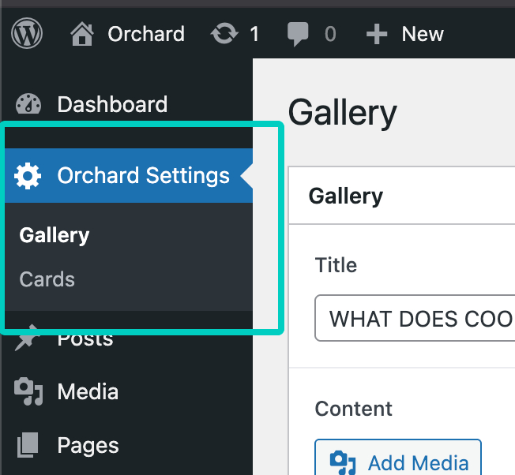

# ORCHARD THEME
Usually, you only add wordpress theme in the repository. But for the sake of an easy setup, I put the the wordpress site in the repository.

## Local Installation
### Prerequisite
Before starting make sure you install these following.
- Nodejs - https://nodejs.org/en
- Composer - https://getcomposer.org/
- WP CLI - https://wp-cli.org/

### Clone or download the repository
Ssh - git clone git@github.com:hyperboink/orchard.git \
Https - git clone https://github.com/hyperboink/orchard.git

Make sure that the repo or folder can be access in your **local server**. If you are using **xamp** or **mamp** it will be in **htdocs**. But for ubuntu, the common folder would be **/var/www/html**.

### Database
In the repo, you can see that there is a db backup under `backups/orchard_db`. Create a db in your local and **import** it in your **local database**.

After the import is done, try to access it in your local server http://localhost/orchard assuming that you are using the default. If you are using the default you should see a wordpress configuration setup.

But if your **local server is a different url**, then run this in your terminal in the **root directory** of the repository. Make sure to **change** http://your-local-url-here with **your actual local server url**.
```
wp search-replace http://localhost/orchard http://your-local-url-here
```
or with port
```
wp search-replace http://localhost/orchard http://your-local-url-here:8000
```
And then go back to http://localhost/orchard and you should see the wordpress configuration setup. Fill the necessary fields for the database information with the database you created in your local.

### Composer
After the above steps you will see something like **Uncaught Error: Class "Orchard\Core\Theme"** not found. We need to run the composer in the **theme folder** since the theme is using **vendor autoload**.
```
cd wp-content/themes/orchard
```
And then run
```
composer install
```

## Frontend assets
We also need to install the npm packages
```
cd wp-content/themes/orchard
```
And then run
```
npm install
```

After installing the npm packages, you can compile the frontend assets by running this command.
```
npm run dev
```
or
```
npm run watch
```
Note: There's no image yet since we don't include the wp-content/uploads in the repository. Make sure you go to the admin **local admin dashboard** to upload the images of the galery and cards.

## Local Admin Dashboard
To access the **local admin dashboard** just append **/wp-admin** to the url. (ex: http://localhost/orchard/wp-admin)  

User: admin  
Pass: password123  

In the admin side menu panel you will see "**Orchard Settings**". Feel free to upload the image theres for gallery and cards.


## Production build
Composer
```
composer install --no-dev --optimize-autoloader
```
Front-end assets
```
npm run build
```

## Production Admin Dashboard Guide
Url: https://hyperboink.net/orchard  
Admin: https://hyperboink.net/orchard/wp-admin  
Credentials: (Will be provided in the email)  


### Admin Settings
You can check the gallery and card settings under side menu admin panel "Orchard Settings"  
Gallery - https://hyperboink.net/orchard/wp-admin/admin.php?page=orchard-gallery   
Cards - https://hyperboink.net/orchard/wp-admin/admin.php?page=orchard-cards  


## Shortcodes
**Gallery Shortcode** (Note: There's no popup image if there's no uploaded image.)
```
[orchard_gallery]
```
**Cards Shortcode**
```
[orchard_cards]
# or with attribute limit which limits the count of the cards shown
[orchard_cards limit="2"]
```
You can see the shortcode in action when you **navigate** to **Pages > Home** in the **admin dashboard** or you can go to this link link. https://hyperboink.net/orchard/wp-admin/post.php?post=6&action=edit

And that's it! 
